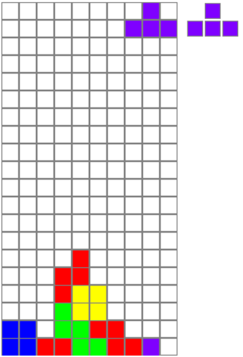
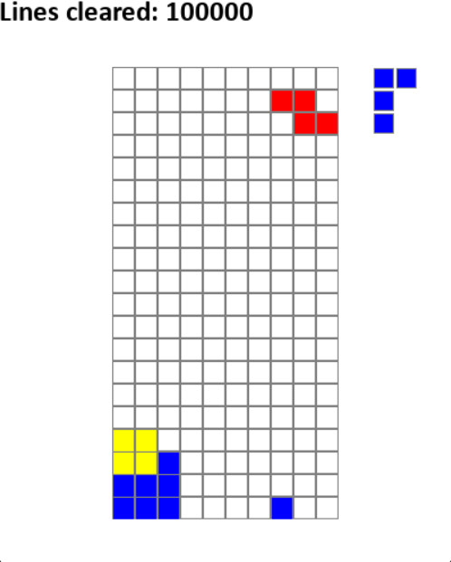

# Tetris Q-Learning

A project implementing Q-Learning for the game Tetris.

## Table of Contents

- [Overview](#overview)
- [Installation](#installation)
- [Sources](#sources)
- [License](#license)

## Overview

This project explores reinforcement learning by applying Q-Learning to the classic game Tetris.

## Installation 

```bash
git clone https://github.com/LouisFrey1/TetrisQLearning.git
cd TetrisQLearning
python -m venv venv
venv\Scripts\Activate
pip install -r requirements.txt
```

## Base Game
Start game: py simulation.py

This branch contains the base game of tetris for the user to play themselves. Use the left and right arrow keys to move the tetromino, the up arrow key to rotate and the spacebar to drop the tetromino. To pause the game, press "p"; to leave press ESC.

## Hardcoded

In the simplest version, the best possible action is decided by simulating all possible actions for the current tetromino (all rotations r and placements p), and calculating 4 values:
- Total height of all columns (a)
- Number of lines cleared (b)
- Number of holes: Empty spaces with tiles above it (c)
- Bumpiness: Total difference in height between each pair of adjacent columns (d)
These values are weighted using the numbers found in https://codemyroad.wordpress.com/2013/04/14/tetris-ai-the-near-perfect-player to calculate a fitness value for each possible action. The action with the heighest fitness value is always taken.

fitness = -0.510066 \times a + 0.760666 \times b - 0.35663 \times c - 0.184483 \times d

If a move results in a game over, it is assigned a fitness of negative infinity.

Due to its simplicity, this model only considers dropping the tetrominos from the top, and is not capable of moving around obstacles, which makes holes a lot more difficult to deal with. Futhermore, this model does not consider the lookahead piece. This might be the reason why the model in the source can run infinitely, while this one cannot.

This model produces decent results, but does not run infinitely. When the blocks are stacked very high, this solution often prioritizes a low bumpiness instead of reducing the height, usually waiting for a I-Tetromino, while ignoring the threat of game over. When there is no way to immediately clear a line, this model doesn't prepare to clear it in the near future; instead it focuses on not creating holes. Furthermore, it seems too comfortable letting the blocks stack up over the halfway point, allowing holes to form in the process and allowing for a quicker defeat.

After running 100 games, the hardcoded model achieved an average of 391.01 lines cleared, with scores ranging between 55 lines cleared and 1674 lines cleared. As these results show, there is a lot of room for improvement.

## Hardcoded With Lookahead

This solution extends the hardcoded version by adding the lookahead piece into the calculation of the best possible move. The fitness of a move is now calculated using the state after 2 moves, instead of just one. This allows the model to think ahead and pull off more complicated maneuvers.



For example, this placement of the T-Tetromino would receive a poor fitness from the previous model, since it creates a hole and does not clear any lines. When paired with the lookahead piece however, the updated model can see that the line can be cleared using the next tetronimo, erasing the hole.

After reaching 100.000 lines cleared, it is safe to assume that this solution allows the game to run infinitely.




The only downside of this solution is the much slower performance. While the previous model only had to simulate p \times r possible actions, this version has to simulate p1 \times r1 \times p2 \times r2 possible actions. If p1=p2=p=8 and r1=r2=r=4, this results in 1024 simulations instead of 32. Clearing 100 lines took this model 28.89 seconds, while the previous one achieved the same in only 4.53 seconds.

## Deep Q-Learning

In this branch, I created a Deep Q-Learning Network, that 

0.01:
Average Score over 100 simulations: 225.89
Single (0.001):
Average Score over 100 simulations: 135.47
4000:
Average Score over 100 simulations: 223.72
10000:
Average Score over 100 simulations: 78.75
Harder:
Average Score over 100 simulations: 135.21
## Sources

https://github.com/vietnh1009/Tetris-deep-Q-learning-pytorch/
https://codemyroad.wordpress.com/2013/04/14/tetris-ai-the-near-perfect-player
https://gist.github.com/timurbakibayev/1f683d34487362b0f36280989c80960c

## License

This project is licensed under the MIT License.