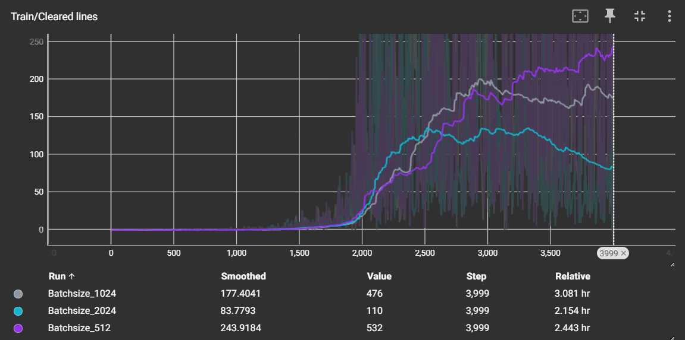
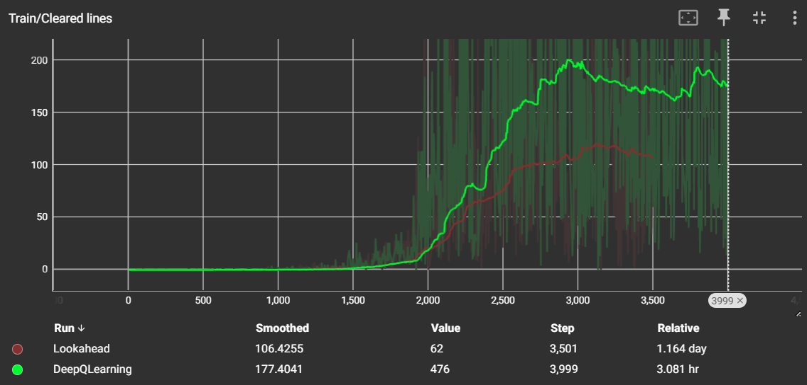
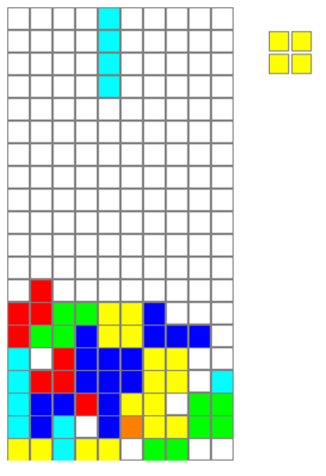
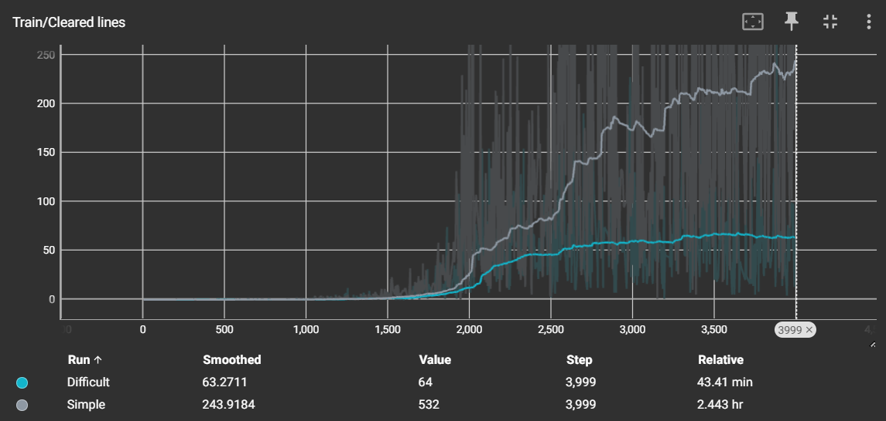

# Tetris Q-Learning

A project implementing Q-Learning for the game Tetris.

## Table of Contents

- [Overview](#overview)
- [Installation](#installation)
- [Hardcoded](#hardcoded)
- [Hardcoded with Lookahead](#hardcodedwithlookahead)
- [DeepQLearning](#deepqlearning)
- [DeepQLearningLookaheadStates](#deepqlearninglookaheadstates)
- [DeepQLearningDifficult](#deepqlearningdifficult)
- [Sources](#sources)
- [License](#license)

## Overview

This project explores reinforcement learning by applying Q-Learning to the classic game Tetris.

## Installation 

```bash
git clone https://github.com/LouisFrey1/TetrisQLearning.git
cd TetrisQLearning
python -m venv venv
venv\Scripts\Activate
pip install -r requirements.txt
```

## Main
Start game: 
```bash
py simulation.py
```

This branch contains the base game of tetris for the user to play themselves. Use the left and right arrow keys to move the tetromino, the up arrow key to rotate and the spacebar to drop the tetromino. To pause the game, press "p"; to restart press ESC.

## Hardcoded
Start game:
```bash
py simulation.py --display_board <True/False> --sim_length <Number of runs to simulate>
```

In the simplest version of the automated game, the best possible action is decided by simulating all possible actions for the current tetromino (all rotations r and placements p), and calculating 4 values:
- Total height of all columns (a)
- Number of lines cleared (b)
- Number of holes: Empty spaces with tiles above it (c)
- Bumpiness: Total difference in height between each pair of adjacent columns (d)
These values are weighted using the numbers found in https://codemyroad.wordpress.com/2013/04/14/tetris-ai-the-near-perfect-player to calculate a fitness value for each possible action. The action with the highest fitness value is always taken.

$fitness = -0.510066 \cdot a + 0.760666 \cdot b - 0.35663 \cdot c - 0.184483 \cdot d$

If a move results in a game over, it is assigned a fitness of negative infinity.

All models in this project only consider dropping the tetrominos from the top, and are not capable of moving around obstacles, which removes a lot of complexity without impacting the game too much. 

This model produces decent results, but does not run infinitely. When the blocks are stacked very high, this solution often prioritizes a low bumpiness instead of reducing the height, ignoring the threat of game over. When there is no way to immediately clear a line, this model doesn't prepare to clear it in the near future; instead it focuses on not creating holes. This leads to blocks stacking up higher, allowing holes to form in the process anyway and allowing for a quicker defeat.

After simulating 100 games, the hardcoded model achieved an average of 391.01 lines cleared, with scores ranging between 55 lines cleared and 1674 lines cleared. As these results show, there is a lot of room for improvement.

## Hardcoded with Lookahead
Start game: 
```bash
py simulation.py --display_board <True/False> --sim_length <Number of runs to simulate>
```
This solution extends the hardcoded version by adding the lookahead piece into the calculation of the best possible move. The fitness of a move is now calculated using the state after 2 moves, instead of just one. This allows the model to think ahead and pull off more complicated maneuvers.


For example, this placement of the T-Tetromino would receive a poor fitness from the previous model, since it creates a hole and does not clear any lines. When paired with the lookahead piece however, the updated model can see that the line can be cleared using the next tetronimo, erasing the hole.

After reaching 100.000 lines cleared, it is safe to assume that this solution allows the game to run infinitely.


The only downside of this solution is the much slower performance. While the previous model only had to simulate $p \cdot r (\text{possible positions} \cdot \text{possible rotations})$ possible actions, this version has to simulate $p_1 \cdot r_1 \cdot p_2 \cdot r_2$ possible actions. If $p_1=p_2=p=8$ and $r_1=r_2=r=4$, this results in 1024 simulations instead of 32. Clearing 100 lines took this model 28.89 seconds, while the previous one achieved the same in only 4.53 seconds.

## DeepQLearning
Train model: 
```bash
py train.py (--lr <learning rate> --gamma <gamma> --num_epochs <number of epochs> --num_decay_epochs <number of exploration epochs> --file_name <filename> --display_board <True/False> --save_interval <save_interval>)
```
The trained model is saved at trained_models/<filename> (tetris_final by default). An additional model is saved at trained_models/"tetris_<epoch>" every <save_interval> epochs (Disabled by default).
To view the training progress and compare to other models, use 
```bash
tensorboard --logdir=runs
```
Test model: 
```bash
py test.py (--file_name <filename> --display_board <True/False> --sim_length <Number of runs to test>)
```
Activate display_board to show the board during training/testing. False by default. Activating this heavily increases the runtime!

The function get_args() in train.py and test.py shows additional optional parameters.

In this branch, I created a Deep Q-Learning Network, that takes a 4-dimensional vector containing the state (height, lines cleared, bumpiness, number of holes) as input and returns a fitness value for the given state, using a hidden layer with 64 units. The weights are initialized using the xavier uniform function.

Training:

* Initialize field, network, optimizer and replay memory.
* Fill 10% of the replay memory with data before starting the first epoch.
* Each epoch consists of a complete game of Tetris; until game over is reached or 5000 lines are cleared (in case the model is able to run infinitely).
* An action is represented as a tuple of (position on x-axis, number of rotations).
* A dictionary mapping the possible actions to the resulting states is generated by simulating all possibilities (similar to the Hardcoded branch).
* I utilize a linearly decaying exploration probability \epsilon, that decides whether to take the predicted action or a random action. After 2000 epochs, the \epsilon value settles at 0.001.
* If the random action is not taken, the deep Q-Network is used to calculate the action that maximizes the fitness of the next state.
* After an action is chosen, the previous state, the current state and the reward is added to the replay memory.
* There are multiple options for the reward function:
  - Quadratic: $1 + lines cleared^2$;
  - Linear: $1 + lines cleared$;
  - Single: 1, if at least 1 line was cleared.
* The first 2 options promote a more risky playstyle that involves leaving a column at the edge, while waiting to clear as many lines as possible with a single I-tetromino, while the last option prioritizes clearing lines whenever possible.
* After each epoch, a batch of samples is taken from the replay memory and used to update the weights of the model.
* Due to the long runtimes and my limited hardware, the optimization of hyperparameters is only possible to a certain degree in this project.
* The training and testing process could be sped up using cuda functionalities, but since there was no way for me to test them, they had to be removed from this project.

Testing:

* The trained model is loaded from the saved file location
* In each step, evaluate all possible next states and choose the action that leads to the highest Q-value
* Due to the high variability of tetris, the random seed is fixed to enable better reproducibility and comparability between models
* The game is run 100 times, calculating the average number of lines cleared per run.

# Comparing reward functions

In a first step of optimization, I had to choose an appropriate reward function. The obvious first choice would be to use the standard tetris score of $1 + lines cleared^2$ (quadratic), but https://www.ideals.illinois.edu/items/118525 shows that a linear function of $1 + lines cleared$ (linear) improves results by prioritizing surviving longer over risking a game over to achieve more points at once. These results could be replicated: Testing both models over 100 runs, the linear approach achieved an average of 134.26 lines cleared, while the quadratic formula achieved only an average of 121.29 lines. However, a different approach that rewards 1, if any lines were cleared and 0 otherwise, outperformed both, clearing an average of 212.34 lines over 100 games. This promotes an even safer approach, discouraging the model from ever attempting to clear multiple lines at once. The following graph shows the training process of the different variations. During training, the model using the quadratic reward function had a few runs with incredibly high scores, as seen by the spikes at around 2200, 2600 and 3000 epochs, clearing up to 3100 lines. However, apart from these outliers, the model performed a lot worse than others.


Reward function | quadratic | linear | single 
--- | --- | --- | --- 
Lines cleared | 121.29 | 134.26 | 212.34

Training Parameters: 
* Batch size = 512
* Learning rate = 0.01
* Gamma = 0.99
* Decay epochs = 2000


# Parameter optimization

In the next step, the most relevant parameters are further optimized. The biggest improvement was a result of doubling the batch size to 1024, so that more samples are used for training in each epoch. However, this improvement was not visible during training; the following graph shows the model with batch size 512 outperforming the one with batch size 1024 by almost 50 points. The difference only became clear during testing, when the new model achieved an average of 324.68 lines cleared; a lot more that the previous 212.34. It is not entirely clear why the better model performed so much worse during training, as the conditions during training and testing are very similar; the only difference being the 0.1% chance of exploration, which should be negligable. Further increasing the batch size to 2048 had an adverse effect, with an average of only 109.57 lines cleared.



Batch size | 512 | 1024 | 2048 
--- | --- | --- | --- 
Lines cleared | 212.34 | 324.68 | 109.57 

Further experiments, like increasing the duration of the exploration phase to 3000 epochs, increasing the number of hidden layers or varying the learning rate only decreased the average score.

Learning rate | 0.001 | 0.01 | 0.02 
--- | --- | --- | --- 
Lines cleared | 135.47 | 324.68 | 262.39

Number of exploration epochs | 2000 | 3000 
--- | --- | ---
Lines cleared | 324.68 | 148.35

Number of hidden layers | 64 | 128
--- | --- | ---
Lines cleared | 324.68 | 184.59


## DeepQLearningLookaheadStates

This variation of the Deep Q-Learning algorithm functions similar to the "Hardcoded with Lookahead" branch: For each tetromino, every possible state after both the current, and the lookahead piece have been played, is compared using the Deep Q-Network. The action that leads to the best possible state after two steps is chosen. Just like with the Hardcoded with Lookahead branch, this variation is a lot slower than the one without lookahead piece, since a lot more states have to be considered in each step. As Figure 7 shows, the training process had to be cancelled at 3500 epochs after over a day, while the previous version only took 3 hours for 4000 epochs. However, even when compared to the previous model at 3500 epochs, the results are clearly much worse. 



However, when testing the new model using the display_board flag, you can see an entirely different playstyle from the standard model. While still performing a lot worse overall (81.17 lines cleared on average), the algorithm uses more advanced set-ups to clear lines by anticipating the next possible move. The following screenshot shows the board in the middle of such a technique. The blue J-tetromino was placed in a suboptimal position (creating 2 holes and not clearing any lines), because the lookahead piece showed a I-tetromino, which is able to clear the line and eliminate the holes. 



With better hardware, allowing for longer training and more optimization, I believe this approach could have the potential to outperform the standard model, similar to its hardcoded counterpart. 

## DeepQLearningDifficult

https://www.ideals.illinois.edu/items/118525 suggests, that increasing the frequency of more difficult blocks (Z and S) during training raises the quality of the model significantly. To replicate this, I set the spawn probability of the Z and S tetrominos to 20% each, while lowering the rest to 10% each. This approach is supposed to train the model to be more proficient in dealing with difficult situations like "drought", which describes the common phenomenon of having to wait a long time for a I-tetromino to appear. 



 | Normal | Difficult 
--- | --- | ---
Lines cleared | 324.68 | 135.21

As the graph of the training process, as well as the table of the tests show, this variation of the Deep Q-Learning algorithm scored a lot worse than the default. The much lower training time of 43 minutes is a result of the much lower scores, not of an improved performance.


## Conclusion

This project showcases the possibility of training a Deep Q-Learning model to play tetris. 

All trained models show a very unexpected inconsistency, sometimes clearing up to 2000 lines, then failing the next run after just 5 lines, even though the exact same conditions apply during both runs. This makes it extremely difficult to compare different models, as the average score can vary greatly when testing the same model multiple times. Even if a model performed better for the seed chosen in this project, it is not automatically guaranteed to better in general. Tetris consists of an enormous amount of possible states, that can only partially be represented by the simplified 4-dimensional vector chosen in this project. For example, https://www.ideals.illinois.edu/items/118525 uses a much larger feature set, including row/column transitions (number of filled cells adjacent to empty cells), the hole depth (number of filled cells above holes) and the number of rows containing at least one hole. Chen also trains the model for 15000 epochs, as opposed to just 4000 in this project.

The best Deep Q-Learning model found in this project (tetris_final) uses the 'single' reward function, a batch size of 1024, 64 hidden layers, a learning rate of 0.01 and does not consider the lookahead piece. However, while the model that uses the lookahead piece scored a lot worse, it showed a lot of promise by starting to use more advanced techniques. Another variation that trains the model to better handle difficult situations by increasing the probability of more undesirable tetrominos only lowered the score. None of the Deep Q-Learning models were able to beat the score set by the algorithm using hardcoded weights to calculate the fitness value of each state.  

## Sources

https://github.com/vietnh1009/Tetris-deep-Q-learning-pytorch/
https://codemyroad.wordpress.com/2013/04/14/tetris-ai-the-near-perfect-player
https://gist.github.com/timurbakibayev/1f683d34487362b0f36280989c80960c
https://www.ideals.illinois.edu/items/118525

## License

This project is licensed under the MIT License.
